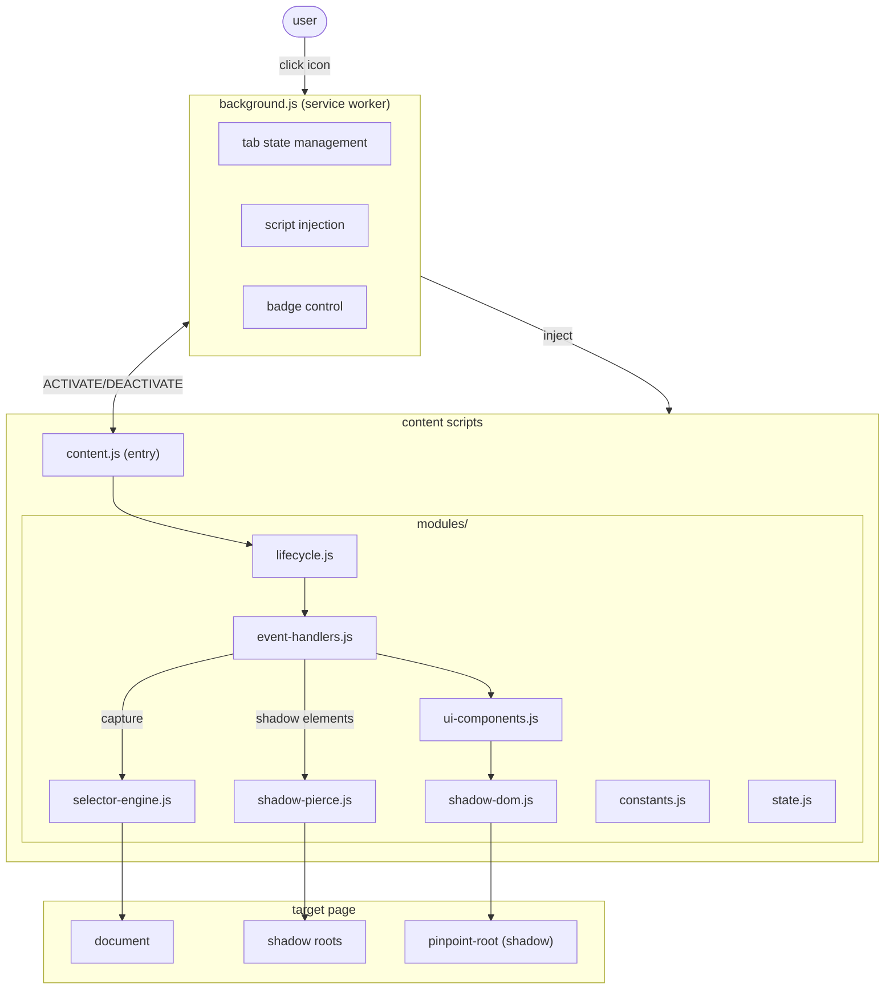

# pinpoint — system overview

> universal dom inspector with shadow-piercing selectors

---

## executive summary

pinpoint is a chrome extension (manifest v3) for capturing stable css selectors from any web page. primary use case: qa automation, agent navigation, and web scraping. differentiator: generates selectors that traverse shadow dom boundaries, outputting playwright (`>>`) and puppeteer (`pierce/`) formats.

capabilities:

- alt+hover highlights elements with bounding box overlay
- alt+click captures element data (selector, dimensions, path)
- arrow key navigation for fine-tuning selection (parent/child/sibling)
- shadow dom piercing with depth awareness
- draggable detail panel with one-click copy
- smart tooltip positioning (auto-flips at viewport edges)
- interactive dom path breadcrumbs (click to navigate ancestors)
- element detachment detection (warns if captured element is removed)
- react/preact component name detection via fiber internals
- namespace-encapsulated modules (`window.Pinpoint.*`)

---

## architecture diagram



---

## data flow

### activation sequence

```
1. user clicks extension icon
2. background.js receives chrome.action.onClicked
3. checks if tab is restricted (chrome://, etc.)
4. checks keepalive port map for script liveness
5. if not alive: injects all content scripts in order
6. sends ACTIVATE message
7. content.js establishes keepalive port, routes to Pinpoint.Lifecycle.init()
8. lifecycle.js creates shadow root, mounts overlay/tooltip
9. event listeners attached (mousemove, click, keydown)
10. badge set to "ON"
```

### element capture flow

```
1. user alt+hovers element
2. handleMouseMove captures event (raf throttled)
3. processMouseMove updates overlay position + tooltip text
4. on alt+click: handleClick fires
5. captureElementData calls:
   - getAllSelectorFormats (checks shadow context)
   - if in shadow: getPiercingSelector builds path across boundaries
   - if light dom: getLightDOMSelector with priority algorithm
6. panel populated, made visible
7. user can copy selector, dimensions, path
```

---

## key concepts

| term                   | definition                                                                                 |
| ---------------------- | ------------------------------------------------------------------------------------------ |
| **shadow pierce**      | traversing shadow dom boundaries to generate selectors that work with playwright/puppeteer |
| **selector priority**  | id → data-_ → aria-_ → class → text → anchored → structural fallback                       |
| **playwright format**  | `host >> .internal-button` (uses `>>` for shadow boundary)                                 |
| **puppeteer format**   | `pierce/host .internal-button` (uses `pierce/` prefix)                                     |
| **structural path**    | last-resort selector using tag names and nth-of-type                                       |
| **anchored selector**  | finds nearest parent with id, uses as anchor point                                         |
| **raf throttling**     | requestAnimationFrame debouncing to prevent layout thrashing                               |
| **orphan cleanup**     | handles stale content scripts after extension reload                                       |
| **pinpoint-root**      | custom element hosting shadow dom for ui isolation                                         |
| **path crumbs**        | interactive breadcrumb buttons for navigating dom ancestry without losing context          |
| **edge-aware tooltip** | tooltip auto-flips position when approaching viewport boundaries                           |
| **keepalive port**     | long-lived chrome.runtime.connect for instant disconnect detection                         |
| **element observer**   | MutationObserver tracking captured element removal from DOM                                |
| **namespace pattern**  | all modules export to `window.Pinpoint.*` to prevent global pollution                      |
| **react fiber**        | traverses `__reactFiber*` internals to extract component displayName or function name      |

---

## dependency graph

### runtime dependencies

none. vanilla javascript, no bundler, no external libraries.

### dev dependencies

| package         | version  | purpose                    |
| --------------- | -------- | -------------------------- |
| `typescript`    | ^5.4.0   | type checking, lsp support |
| `@types/chrome` | ^0.0.268 | chrome extension api types |

### why minimal?

- chrome extensions don't benefit from bundlers for small projects
- vanilla js executes faster, no framework overhead
- csp compliance: no eval, no inline scripts required
- easier debugging: source maps not strictly necessary

---

## permissions

| permission  | justification                                           |
| ----------- | ------------------------------------------------------- |
| `activeTab` | access current tab only when user clicks icon           |
| `scripting` | inject content scripts dynamically                      |
| `storage`   | persist active tab state across service worker restarts |

---

## design patterns

### state management

- **background**: `chrome.storage.session` for persistence, in-memory `Set` for fast access
- **content**: global variables in `state.js`, module-level closure

### event handling

- capture phase (`true` third arg) for reliable interception
- raf throttling to coalesce rapid mouse events

### selector generation

- priority-based algorithm with early exit on unique match
- caching via `WeakMap` tied to element lifecycle
- escape all user content with `CSS.escape()`

### shadow dom isolation

- all ui lives in `pinpoint-root` shadow dom
- prevents style leakage onto host page
- z-index max (2147483647) for overlay priority

---

## Installation

1. Clone or download this repo
2. Open chrome://extensions/
3. Enable Developer mode
4. Click Load unpacked
5. Select the `pinpoint` folder

---

_model-assisted development_

_this project was developed with the assistance of an AI model. while the code is self-contained and does not require external dependencies, the development process was supported by an AI model to enhance productivity and accuracy._

{{user}}->{{reviewer}}->{{prompt}}->{{model}}->{{code}}->{{user}}
